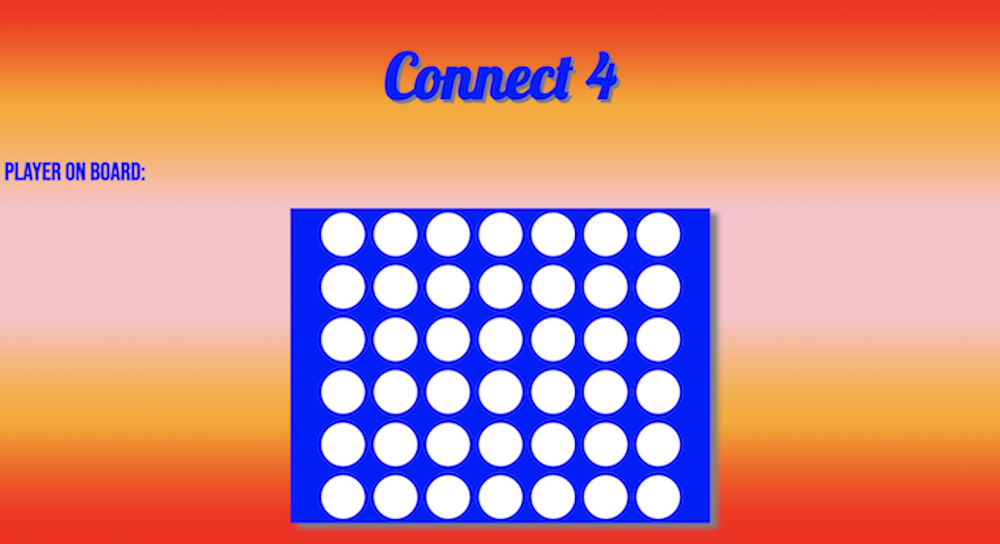

<h1>Connect 4</h1>

How to Play
1. This is a two player game
2. Player One has token yellow/green and Player Two has token red
3. Player one will start the game
4. Players will alternate turns until a player wins then game will announce the winner / loser
5. In order to win, player needs four of their token color in a row
6. Once there's four in a row, game will announce winner/loser

Link to deployment:

https://imaniintech.github.io/Connect4/